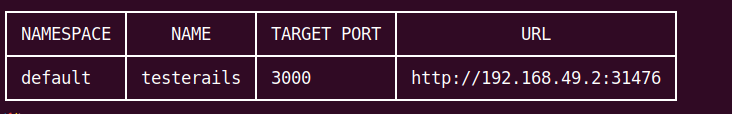
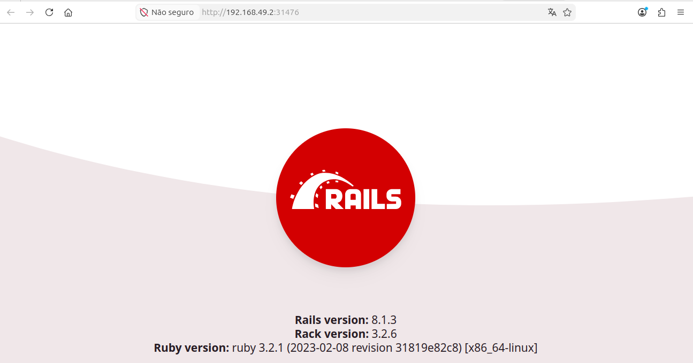

# Implementar um deploy de uma imagem local com Kubernetes e Minikube

\
**Crie uma imagem local:**
\
 docker build -t testerails:v1
\
\
**Carregue a imagem no minikube:**
\
 minikube image load testerails:v1
\
\
**Salve a imagem em tar, caso queira carrega-la depois pelo arquivo(opcional):**
\
 minikube image save testerails:v1 testerails.tar
\
\
**Carregando a imagem pelo arquivo(opcional):**
\
 minikube image load testerails.tar
\
\
**Crie o deployment:**
\
 kubectl create deployment testerails --image testerails:v1
\
\
**Patch do deployment:**
\
kubectl patch deployment testerails -p '{"spec":{"template":{"spec":{"containers":[{"name":"testerails", "imagePullPolicy":"Never"}]}}}}'
\
\
**Para acessar sua aplicação pelo navegador:**
\
 kubectl expose deployment testrails --type=NodePort --port=3000 
\
 minikube service testerails
\
Por fim esse será um resultado semelhante a esse, com IP e porta diferente:
\
\

\
\
